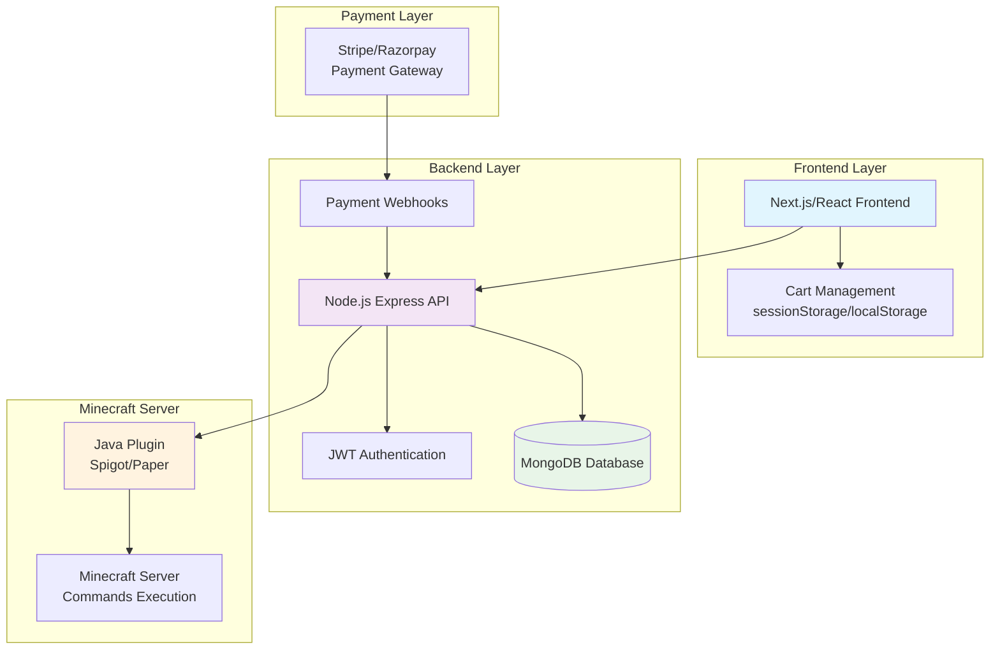
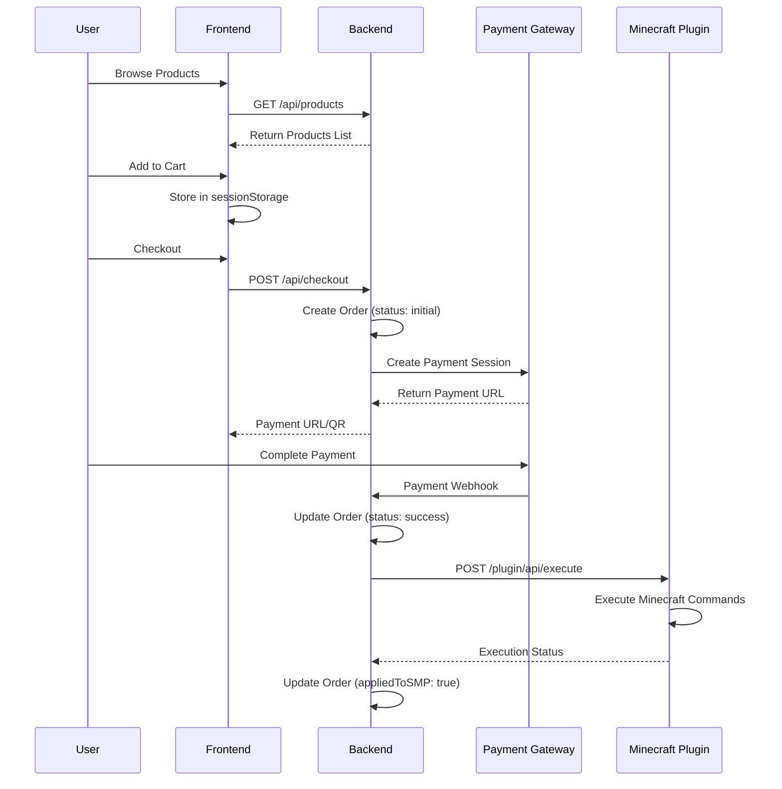
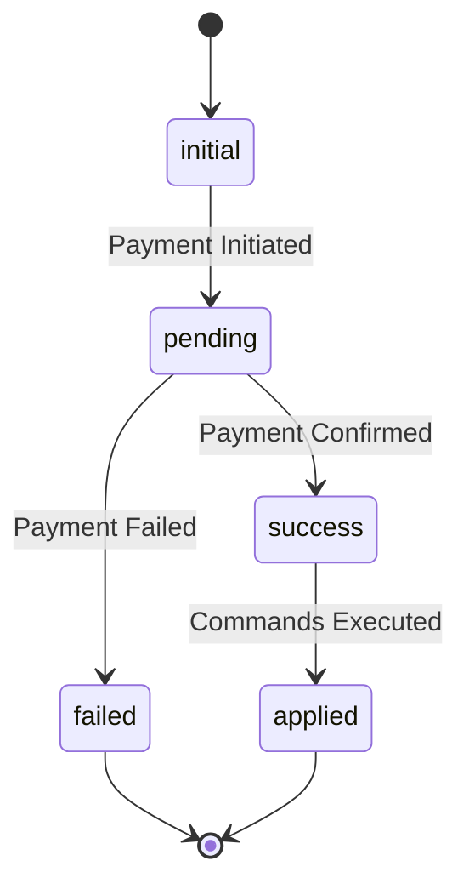

# CosmomcShop - Minecraft Server E-Commerce Platform

A full-stack e-commerce solution for Minecraft servers, enabling players to purchase in-game items like coins, ranks, and crates through a web interface with real-time integration to the Minecraft server.

## 🏗️ System Architecture



## 🔄 Data Flow Architecture



## 🏛️ System Components

### 🟦 A. Frontend (Next.js/React)
- **User Authentication** (Login/Register)
- **Product Listing** (coins, ranks, crates)
- **Cart Management** (sessionStorage for persistence)
- **Checkout Process** via payment gateway
- **Purchase Confirmation** and order tracking

### 🟦 B. Backend (Node.js + Express)
- **RESTful API** to support frontend operations
- **JWT Authentication** for secure user sessions
- **MongoDB Database** integration
- **Payment Integration** (Tebex)
- **Minecraft Plugin Integration** via HTTP/Socket

### 🟦 C. Minecraft Plugin (Java + Spigot/Paper)
- **UDP Server** receives commands from backend
- **Command Execution** (/give, /crate, /rank)
- **Request Verification** using shared secret
- **Status Reporting** back to backend

## 🗃️ Database Schema

### User Collection
```javascript
{
  "_id": ObjectId,
  "username": "kartikey",
  "email": "k@example.com",
  "passwordHash": "...",
  "minecraftUsername": "KartikeyMC",
  "roles": ["player"], // or ["admin"]
  "createdAt": ISODate,
  "updatedAt": ISODate
}
```

### Product Collection
```javascript
{
  "_id": ObjectId,
  "name": "500 Coins",
  "type": "coin" | "rank" | "crate",
  "price": 249,
  "commandTemplate": "/give {{username}} 500coins",
  "metadata": { "rank": "vip" },
  "isActive": true
}
```

### Order Collection
```javascript
{
  "_id": ObjectId,
  "userId": ObjectId,
  "items": [
    {
      "productId": ObjectId,
      "name": "500 Coins",
      "quantity": 1,
      "command": "/give KartikeyMC 500coins",
      "price": 249
    }
  ],
  "totalAmount": 249,
  "status": "initial" | "pending" | "success" | "failed",
  "paymentGateway": "stripe",
  "isAppliedToSMP": false,
  "createdAt": ISODate,
  "paidAt": ISODate,
  "transactionId": String
}
```

## 📊 Order State Management



## 🔗 API Endpoints

### Authentication
- `POST /api/auth/register` - User registration
- `POST /api/auth/login` - User login
- `POST /api/auth/logout` - User logout

### Products
- `GET /api/products` - Fetch all products (coins, ranks, crates)
- `GET /api/products/:id` - Get specific product details

### Cart & Orders
- `POST /api/cart` - Save cart (optional for logged-in users)
- `POST /api/checkout` - Create order and initiate payment
- `GET /api/orders` - Get user's order history
- `GET /api/orders/:id` - Get specific order details

### Payments
- `POST /api/payment/webhook` - Payment gateway webhook handler

### Admin
- `GET /api/admin/reports` - Sales analytics and reports
- `GET /api/admin/orders` - All orders with filters

### Minecraft Integration
- `POST /api/plugin/execute` - Send commands to Minecraft plugin

## 🛒 Cart Management Strategy

### Frontend Cart Storage
We use **sessionStorage** for optimal performance and user experience:

```javascript
// Save cart
sessionStorage.setItem("cart", JSON.stringify(cartItems));

// Load cart
const cart = JSON.parse(sessionStorage.getItem("cart") || "[]");
```

### Cart Persistence Comparison
| Storage Method | Survives Refresh | Survives Tab Close | Cross-Device |
|----------------|------------------|-------------------|--------------|
| sessionStorage | ✅ Yes | ❌ No | ❌ No |
| localStorage | ✅ Yes | ✅ Yes | ❌ No |
| Database | ✅ Yes | ✅ Yes | ✅ Yes |

**Choice**: sessionStorage for guest users, with option to save to database for logged-in users.

## 👥 User Roles & Permissions

### 🔵 User Role
- Browse and purchase products
- Manage cart and checkout
- View personal transaction history
- Update profile and Minecraft username

### 🔴 Admin Role  
- Access to admin dashboard
- View sales analytics and reports
- Monitor all transactions
- Manage products (CRUD operations)
- View customer statistics

## 🔐 Security Considerations

### Authentication
- JWT tokens for session management
- Password hashing using bcrypt
- Input validation and sanitization

### Payment Security
- Webhook signature verification
- Secure API key management
- PCI compliance through payment processors

### Minecraft Integration
- Shared secret verification
- Command sanitization
- Rate limiting on plugin endpoints

## 🚀 Getting Started

### Prerequisites
- Node.js 18+ 
- MongoDB 4.4+
- Java 17+ (for Minecraft plugin)
- Minecraft Server (Spigot/Paper)

### Installation

1. **Clone the repository**
```bash
git clone https://github.com/ImKartikey27/CosmomcShop.git
cd CosmomcShop
```

2. **Install dependencies**
```bash
npm install
```

3. **Environment Setup**
```bash
cp .env.example .env
# Configure your environment variables
```

4. **Database Setup**
```bash
# Start MongoDB
mongod

# Run database migrations (if any)
npm run db:migrate
```

5. **Start Development Server**
```bash
npm run dev
```

### Environment Variables
```env
# Database
MONGODB_URI=mongodb://localhost:27017/cosmomc

# JWT Secret
JWT_SECRET=your-jwt-secret-key

# Payment Gateway
STRIPE_SECRET_KEY=sk_test_...
STRIPE_WEBHOOK_SECRET=whsec_...
RAZORPAY_KEY_ID=rzp_test_...
RAZORPAY_KEY_SECRET=...

# Minecraft Plugin
MINECRAFT_SERVER_URL=http://localhost:8080
MINECRAFT_SHARED_SECRET=your-shared-secret
```

## 📁 Project Structure

```
cosmomc/
├── src/
│   ├── app/                 # Next.js app directory
│   ├── components/          # Reusable React components
│   ├── lib/                 # Utility functions and configurations
│   ├── models/              # Database models
│   └── api/                 # API routes
├── public/                  # Static assets
├── minecraft-plugin/        # Java plugin source
├── docs/                    # Documentation
└── tests/                   # Test files
```

## 🧪 Testing

```bash
# Run all tests
npm test

# Run tests with coverage
npm run test:coverage

# Run specific test suite
npm run test:api
npm run test:frontend
```

## 📈 Performance Considerations

### Frontend Optimization
- Cart stored in sessionStorage (no unnecessary API calls)
- Product list caching
- Image optimization for product thumbnails
- Lazy loading for product grids

### Backend Optimization  
- Database indexing on frequently queried fields
- Connection pooling for MongoDB
- Rate limiting on sensitive endpoints
- Caching for product listings

### Minecraft Integration
- Batched command execution
- Command queue for high-traffic periods
- Retry mechanism for failed commands

## 🔄 Deployment

### Production Checklist
- [ ] Environment variables configured
- [ ] Database backed up and migrated
- [ ] SSL certificates installed
- [ ] Payment webhook URLs updated
- [ ] Minecraft plugin deployed
- [ ] Monitoring and logging setup

### Recommended Stack
- **Frontend**: Vercel or Netlify
- **Backend**: Railway, Heroku, or AWS
- **Database**: MongoDB Atlas or AWS DocumentDB
- **Minecraft**: Dedicated server or VPS

## 📊 Monitoring & Analytics

### Key Metrics
- Total sales and revenue
- Conversion rates by product type
- Failed vs successful transactions
- User acquisition and retention
- Server command execution success rates

### Logging
- User authentication events
- Payment processing logs
- Minecraft command execution logs
- Error tracking and alerting

## 🤝 Contributing

1. Fork the repository
2. Create a feature branch (`git checkout -b feature/amazing-feature`)
3. Commit your changes (`git commit -m 'Add amazing feature'`)
4. Push to the branch (`git push origin feature/amazing-feature`)
5. Open a Pull Request

## 📄 License

This project is licensed under the MIT License - see the [LICENSE](LICENSE) file for details.

## 📞 Support

For support, email support@cosmomc.com or join our Discord community.

## 🗺️ Roadmap

- [ ] Multi-server support
- [ ] Subscription-based ranks
- [ ] Mobile app development
- [ ] Advanced analytics dashboard
- [ ] Multi-language support
- [ ] Cryptocurrency payment integration

---

**Built with ❤️ for the Minecraft community**